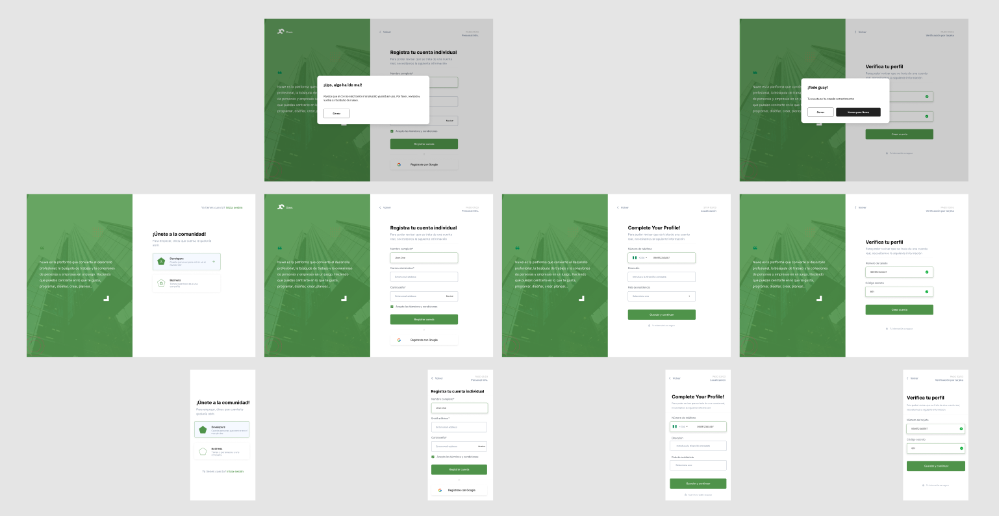
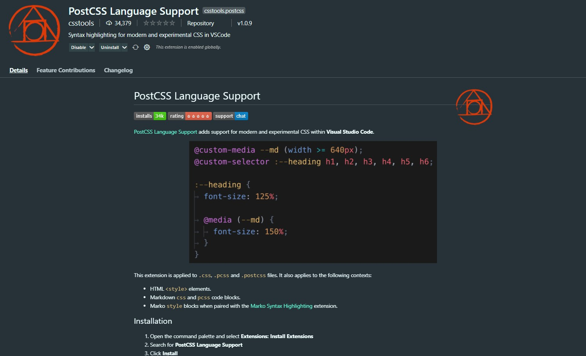

# Frontend Nuwe Hackathon  #

## Presentación 👋

Hola!, me da gusto que vengas a este repositorio, este contenido ha sido realizado como parte de un Hackathon organizado por [Nuwe](nuwe.io).

El proyecto consiste en realizar la maquetación de un diseño cumpliendo los User Tasks solicitados, el diseño es el siguiente:

## Muestra 👀

Un pequeño _showcase_ del proyecto en web.

[Enlace a la aplicación](https://nuwe-hackathon.netlify.app/)

## Pre-requisitos 📋

Necesario para correr el proyecto, no me sucede pero hay algunos a quien les pasa que no pueden alzar el repositorio.

### PostCSS Language Support *extension*

## Comencemos 🚀

Para empezar ejecutemos los siguientes comandos en ese orden:
~~~
git clone https://github.com/JorgeRojas827/nuwe-hackathon.git

cd nuwe-hackathon

npm i
~~~

Y listo, puedes probar y jugar con el código :)

## Construido con 🛠️

- ### React JS - Framework JS
- ### Tailwind CSS - Framework CSS

## Licencia 📄

Este proyecto está bajo la Licencia (MIT) - puedes mirar clonar y utilizar el código como gustes.

## ⌨️ con ❤️ por Jorge Rojas 🙌
